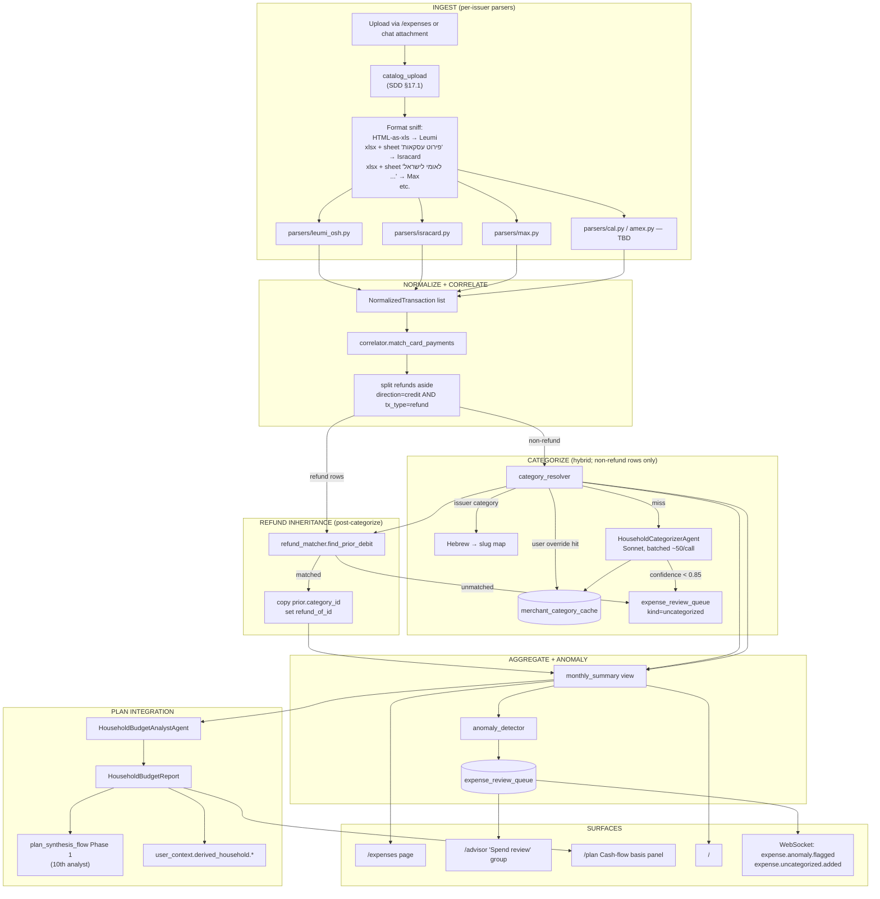

# Argosy — Household Expenses & Cash-Flow Analysis Design

| Field | Value |
|---|---|
| **Date** | 2026-05-09 |
| **Status** | Design approved; spec awaiting user review |
| **Authors** | Ariel + Claude (collaborative brainstorm) |
| **Related** | [SDD §3 Agent Fleet](../../design/SDD.md#3-agent-fleet), [SDD §6.5 Advisor / gap tracker](../../design/SDD.md#65-advisor-reframe--gap-tracker--persistent-panel), [SDD §6.11 Plan synthesis flow](../../design/SDD.md#611-plan-synthesis-flow-wave-2-of-plan-distillate-work), [SDD §8 Data Layer](../../design/SDD.md#8-data-layer), [SDD §11 UI Design](../../design/SDD.md#11-ui-design), [SDD §17 Provenance](../../design/SDD.md#17-provenance--accountability) |
| **Sample data** | `D:\Google Drive\Family\Finances\Portfolio\Resources\2025` and `\2026` (Leumi `.xls`, card `1266` Isracard, card `6225` Max) |
| **Phasing** | Lands as a new SDD section §18; cross-references §3 (new analyst), §6 (advisor + plan synthesis), §8 (5 new tables, 1 migration), §11 (new top-level tab + home/advisor/plan touches). |

---

## 1. Context & motivation

The user was asked, "what are your monthly household expenses?" and could not answer. Argosy already monitors investments, plan adherence, and concentration — but it has no surface for **cash flow**. Consequence: the wealth plan operates on user-stated guesses about household spend (`goals.near_term_spending` is a list of self-reported amounts), and the synthesizer cannot tell whether the plan's assumptions match reality.

The user's framing of the desired feature:

> I want to provide leumi bank statements — all transfers from the past year. And give the credit cards statements (if card X charges Y it will be seen in Leumi statement also as Y, but the card will show the details). You will need to analyze and find correlations and give an overview — X spent on restaurants, Y on insurance — and flag irregularities. I want to give you a new statement on a monthly cadence; you (advisor) should flag/remind me when missing.

Plus the deeper integration ask:

> Make sure information merges into the Advisor planning (i.e. income and expenses, travel should also be a predictable, e.g. 40k a year, and so does a new car — e.g. ~50k a year accumulated, until we buy a car; new car is between 100-300k, new or used, and we got 2).

The motivation is therefore not "build a budget tracker" — Argosy is not Mint. The motivation is **close the loop between observed cash flow and synthesized plan**, so the plan is grounded in evidence rather than self-report. A view-only dashboard is a means; the goal is feeding empirical income/spend into `plan_synthesis_flow` (§6.11) and the gap-tracker (§6.5).

### Concrete workflow this design supports

1. User uploads a year of statements (1 Leumi current account + 4 cards, today). `expense_*` tables populate.
2. The system categorizes every transaction (hybrid: issuer-seeded + cache + LLM, with low-confidence rows falling to a review queue).
3. The system correlates each bank "credit-card payment" line to the matching card statement (deterministic on `אסמכתא` reference column), so we don't double-count.
4. A new `HouseholdBudgetAnalystAgent` joins Phase 1 of `plan_synthesis_flow` and produces a structured `HouseholdBudgetReport` (income shape, monthly avg by category, predictable annual outflows, anomalies, coverage gaps).
5. The `PlanSynthesizerAgent` reads that report and emits horizons whose targets quote derived figures with basis ("save ₪40k/yr toward travel, observed 11/12 months").
6. The advisor surfaces:
   - Missing-statement gaps via the existing `gap_tracker` (`monthly` freshness band).
   - Newly-derived predictables for user confirmation ("lock in ₪40k/yr travel?").
   - Anomalies needing user judgement ("restaurants spiked last month — anything to know?").
7. The user's responses feed back into `merchant_category_cache` (overrides) and `expense_review_queue` (closures), so the system gets smarter without re-asking.

---

## 2. Out of scope / non-goals

To keep this focused:

- **Not a budgeting/envelope app.** No "you've spent 80% of your dining budget this month, stop." Argosy reports facts and flags anomalies; the budget envelope, if any, is the plan's `near_term_spending` reservation, not a tactical limit.
- **Not a tax-prep tool.** Tax categorization (deductible vs. non-deductible) is downstream of `TaxAnalystAgent` (existing, §3.1) and not in scope here.
- **Not multi-currency normalization beyond the issuer.** Isracard rows in USD stay in USD on the row; aggregation uses the issuer's stated NIS charge amount (`סכום חיוב`) which is post-FX. Cross-currency historic re-pricing is not done.
- **Not real-time / streaming.** Statements arrive monthly. Backfill is one-shot. Re-categorisation is on-demand after override.
- **No bank-API integration.** Leumi has no customer API (existing §9.1). Statement upload is the contract.
- **No spouse-level attribution.** Per user direction (joint account), the household is the only aggregation unit. `cardholder_name` is informational metadata only.
- **No "budget recommendation" agent.** The plan synthesizer already encodes intent; we don't need a second voice telling the user "you should spend less on X." Anomalies are factual; recommendations belong to the plan, not the expense subsystem.

---

## 3. Architecture overview

### 3.1 Subsystem boundaries

A new subsystem **`expenses`** living at:

- `argosy/services/expense_ingest/` — parsers (per issuer) + correlator + categorizer + anomaly detector
- `argosy/agents/household_categorizer.py` — LLM-driven categorization (Sonnet, batched)
- `argosy/agents/household_budget.py` — `HouseholdBudgetAnalystAgent` (Sonnet, structured report)
- `argosy/api/routes/expenses.py` — REST surface
- `argosy/state/models.py` — 6 new ORM tables (`expense_sources`, `expense_statements`, `expense_transactions`, `expense_categories`, `merchant_category_cache`, `expense_review_queue`)
- `alembic/versions/0021_household_expenses.py` — single migration
- `ui/src/app/expenses/page.tsx` — new top-level page
- Touches: `ui/src/components/nav.tsx` (add tab), `ui/src/app/page.tsx` (CashFlowTile), `ui/src/app/advisor/page.tsx` (Spend review group), `ui/src/app/plan/page.tsx` (Cash-flow basis panel)

### 3.2 Pipeline diagram



### 3.3 Boundary contracts

Single-byte-blob entry: `argosy/services/file_catalog.py::catalog_upload`. Every uploaded statement flows through it (per provenance Wave A — SDD §17.1) so the file is content-addressed-deduped, audit-logged, and recoverable on the `/files` page. The expense ingest pipeline reads from `user_files` rows, not from raw uploads.

Single-process orchestrator: `argosy/services/expense_ingest/orchestrator.py::ingest_user_file(user_file_id)`. Idempotent — re-running on the same `user_file_id` produces zero new rows. This makes the year-zero backfill safe to retry.

---

## 4. Data model

### 4.1 Tables

**Migration `0021_expenses_v1`**, single Alembic revision. All new tables; no edits to existing rows. Five new tables plus one for the review queue:

```
expense_sources
─────────────────────────────────────────────────────────────────────
  id              INTEGER PK
  user_id         TEXT FK→users.id   NOT NULL
  kind            TEXT                  NOT NULL   ('bank' | 'card')
  issuer          TEXT                  NOT NULL   ('leumi' | 'isracard' | 'max' | 'cal' | 'amex' | 'diners' | …)
  external_id     TEXT                  NOT NULL   (last-4 for cards; account# for banks)
  display_name    TEXT                  NOT NULL   (user-facing label)
  cardholder_name TEXT                  NULL       (informational; spend rolls to household)
  active          BOOLEAN               NOT NULL DEFAULT TRUE
  created_at      TIMESTAMP             NOT NULL DEFAULT now()
  UNIQUE(user_id, kind, external_id)

expense_statements
─────────────────────────────────────────────────────────────────────
  id                  INTEGER PK
  user_id             TEXT FK→users.id          NOT NULL
  source_id           INTEGER FK→expense_sources NOT NULL
  file_id             INTEGER FK→user_files     NOT NULL    (provenance link, §17.1)
  period_start        DATE                       NOT NULL
  period_end          DATE                       NOT NULL
  charge_date         DATE                       NULL        (for cards: 'לחיוב ב-')
  declared_total_nis  NUMERIC(12,2)              NULL        (issuer-stated total, when present)
  parsed_total_nis    NUMERIC(12,2)              NOT NULL    (sum of our parsed rows)
  parser_name         TEXT                       NOT NULL    ('leumi_osh' | 'isracard' | 'max' | …)
  parser_version      TEXT                       NOT NULL    (semver — for forensics)
  status              TEXT                       NOT NULL    ('parsed' | 'failed' | 'partial')
  parse_error         TEXT                       NULL
  ingested_at         TIMESTAMP                  NOT NULL DEFAULT now()
  UNIQUE(user_id, source_id, period_start, period_end)
  INDEX(user_id, period_end DESC)

expense_transactions
─────────────────────────────────────────────────────────────────────
  id                    INTEGER PK
  user_id               TEXT FK→users.id        NOT NULL
  statement_id          INTEGER FK→expense_statements NOT NULL
  source_id             INTEGER FK→expense_sources NOT NULL
  occurred_on           DATE                     NOT NULL    (purchase / value date)
  posted_on             DATE                     NULL        (debit date if known)
  merchant_raw          TEXT                     NOT NULL    (verbatim from statement)
  merchant_normalized   TEXT                     NOT NULL    (cache key — see §7.2)
  amount_nis            NUMERIC(12,2)            NOT NULL    (always-positive)
  amount_orig           NUMERIC(12,2)            NULL        (when ≠ NIS)
  currency_orig         CHAR(3)                  NULL        ('USD' | 'EUR' | …)
  direction             TEXT                     NOT NULL    ('debit' | 'credit')
  tx_type               TEXT                     NOT NULL    ('regular' | 'standing_order' | 'installment' | 'refund')
  reference             TEXT                     NULL        (אסמכתא | voucher # | similar)
  category_id           INTEGER FK→expense_categories NULL  (NULL = uncategorized; resolved post-pipeline)
  category_source       TEXT                     NULL        ('issuer' | 'cache' | 'llm' | 'user' | 'inherited_from_refund')
  category_confidence   NUMERIC(3,2)             NULL        (0.00–1.00; NULL when source='user' or 'issuer')
  is_card_payment       BOOLEAN                  NOT NULL DEFAULT FALSE
  matched_statement_id  INTEGER FK→expense_statements NULL  (set when is_card_payment=TRUE)
  refund_of_id          INTEGER FK→expense_transactions NULL (set when this row offsets a prior debit)
  raw_row_json          JSON                     NOT NULL    (forensic — original parsed row)
  ingested_at           TIMESTAMP                NOT NULL DEFAULT now()
  INDEX(user_id, occurred_on DESC)
  INDEX(user_id, merchant_normalized)
  INDEX(user_id, category_id, occurred_on DESC)

expense_categories
─────────────────────────────────────────────────────────────────────
  id                       INTEGER PK
  user_id                  TEXT FK→users.id   NULL    (NULL = system-default, copied per user on first run)
  slug                     TEXT               NOT NULL  (snake_case, e.g. 'dining_out.restaurants')
  label_en                 TEXT               NOT NULL
  label_he                 TEXT               NOT NULL
  parent_id                INTEGER FK→expense_categories NULL
  is_excluded_from_spend   BOOLEAN            NOT NULL DEFAULT FALSE
  is_inflow                BOOLEAN            NOT NULL DEFAULT FALSE
  display_order            INTEGER            NOT NULL DEFAULT 0
  UNIQUE(user_id, slug)

merchant_category_cache
─────────────────────────────────────────────────────────────────────
  id                  INTEGER PK
  user_id             TEXT FK→users.id        NOT NULL
  merchant_pattern    TEXT                     NOT NULL    (normalized merchant string OR /regex/)
  is_regex            BOOLEAN                  NOT NULL DEFAULT FALSE
  category_id         INTEGER FK→expense_categories NOT NULL
  source              TEXT                     NOT NULL    ('issuer_seed' | 'llm' | 'user')
  confidence          NUMERIC(3,2)             NOT NULL    (1.00 for source='user'; 0.85+ for 'llm'; 0.90 for 'issuer_seed')
  hit_count           INTEGER                  NOT NULL DEFAULT 0
  last_hit_at         TIMESTAMP                NULL
  created_at          TIMESTAMP                NOT NULL DEFAULT now()
  UNIQUE(user_id, merchant_pattern, is_regex)
  INDEX(user_id, merchant_pattern)

expense_review_queue
─────────────────────────────────────────────────────────────────────
  id                INTEGER PK
  user_id           TEXT FK→users.id           NOT NULL
  kind              TEXT                        NOT NULL  ('uncategorized' | 'mom_category_spike' | 'new_recurring' | 'recurring_price_jump' | 'recurring_missed' | 'big_one_off' | 'coverage_gap')
  status            TEXT                        NOT NULL DEFAULT 'open'  ('open' | 'acknowledged' | 'resolved' | 'dismissed')
  payload_json      JSON                        NOT NULL  (kind-specific, see §10.2)
  related_tx_id     INTEGER FK→expense_transactions NULL
  related_source_id INTEGER FK→expense_sources NULL
  user_note         TEXT                        NULL       (text the user adds when they 'acknowledge')
  created_at        TIMESTAMP                   NOT NULL DEFAULT now()
  resolved_at       TIMESTAMP                   NULL
  INDEX(user_id, status, created_at DESC)
```

### 4.2 Default taxonomy (seeded on first run for each user)

System-default rows (`user_id IS NULL` then copied to user-scoped rows on first ingest, so per-user customization is possible):

| Top-level | Children | `is_excluded_from_spend` | `is_inflow` |
|---|---|---|---|
| `income` | `salary`, `rsu_vest_proceeds`, `bonus`, `child_benefit`, `interest_credit`, `other_recurring_income` | F | T |
| `housing` | `mortgage`, `property_tax`, `utilities_electric`, `utilities_water_gas`, `internet_phone`, `home_maintenance`, `furniture` | F | F |
| `food` | `groceries` | F | F |
| `dining_out` | `restaurants`, `takeout`, `coffee_bars` | F | F |
| `transportation` | `fuel`, `public_transit`, `parking`, `car_insurance`, `car_maintenance`, `taxi_rideshare` | F | F |
| `healthcare` | `health_insurance`, `pharmacy`, `dental`, `doctors`, `medical_other` | F | F |
| `insurance_other` | `life`, `home`, `umbrella`, `other` | F | F |
| `childcare_education` | `daycare`, `tuition`, `after_school`, `education_materials`, `kids_activities` | F | F |
| `subscriptions` | `streaming`, `software`, `gym`, `news`, `other_subscription` | F | F |
| `discretionary` | `shopping_clothing`, `shopping_other`, `entertainment`, `hobbies`, `gifts_to_others`, `charity` | F | F |
| `travel` | `flights`, `hotels`, `vacation_other` | F | F |
| `personal` | `personal_care` | F | F |
| `financial` | `bank_fees`, `fx_fees`, `interest_paid_other` | F | F |
| `transfers` | `internal_transfer`, `paybox_to_household`, `atm_cash_withdrawal` | T | F |
| `investments` | `broker_buy_us`, `broker_buy_il`, `retirement_contrib`, `keren_hishtalmut_contrib`, `savings_deposit` | T | F |
| `taxes` | `income_tax_paid`, `social_security_paid` | T | F |
| `uncategorized` | (no children — terminal) | F | F |

**Rules embodied:**
- `food` is groceries-only. `dining_out` is its own top-level (per user direction).
- Refunds are **not** a category. They're transactions with `direction='credit'` whose `category_id` is set to the matching prior debit's category by the refund matcher (§6).
- `is_excluded_from_spend = TRUE` rows render in MoM views but are subtracted from the "real spending" total (matches `transfers`, `investments`, `taxes`).
- `is_inflow = TRUE` rows count as income (only `income.*`).
- **Aggregation logic** (canonical, used by `monthly-summary` endpoint and `HouseholdBudgetReport`):
  - `real_spending(month) = SUM(amount_nis * sign) WHERE direction='debit' AND category.is_excluded_from_spend = FALSE AND category.is_inflow = FALSE AND is_card_payment = FALSE`. Refunds counter-sign within the same category via the prior-debit linkage, so a refunded purchase nets to ~zero in the category total.
  - `real_income(month) = SUM(amount_nis) WHERE direction='credit' AND category.is_inflow = TRUE`.
  - Inflow rows (income) never appear in `real_spending` because the `direction='debit'` filter already excludes them; `is_excluded_from_spend=FALSE` on `income.*` is therefore informational, not load-bearing.
- The `uncategorized` row is special: rows landing here generate `expense_review_queue` items.

### 4.3 Issuer-category Hebrew → slug map (Max card 6225)

Static lookup, embedded in `argosy/services/expense_ingest/issuer_seed.py`:

| `ענף` | Slug | Confidence |
|---|---|---|
| `מסעדות` | `dining_out.restaurants` | 0.90 |
| `תיירות` | `travel.vacation_other` | 0.85 |
| `רפואה ובריאות` | `healthcare.medical_other` | 0.85 |
| `ביטוח ופיננסים` | (defer to LLM with hint) | 0.50 — too wide; could be insurance or financial |
| `תקשורת ומחשבים` | (defer to LLM with hint) | 0.50 — could be `subscriptions.software`, `housing.internet_phone`, `discretionary.entertainment` |
| `ריהוט ובית` | `housing.home_maintenance` | 0.80 |
| `מקצועות חופשיים` | (defer to LLM with hint) | 0.50 — accountant, lawyer, contractor — varies |
| `סופרמרקטים`, `חנויות מזון` | `food.groceries` | 0.90 |
| `דלק ותחנות דלק` | `transportation.fuel` | 0.95 |
| `לבוש והנעלה` | `discretionary.shopping_clothing` | 0.90 |
| `בידור ותרבות` | `discretionary.entertainment` | 0.85 |
| (any unknown ענף value) | (defer to LLM with hint=`ענף`) | 0.40 |

This table is incomplete — sample data only covers seven `ענף` values. The migration includes a `argosy admin expenses-issuer-coverage` CLI that scans all parsed Max statements for unique `ענף` values and prints the ones missing from the map; we extend the map as new values appear in production.

---

## 5. Ingestion + parsers

### 5.1 Format detection

`argosy/services/expense_ingest/sniff.py::detect_format(user_file)`:

```python
def detect_format(file: UserFile) -> ParserName:
    # 1. Sniff by content first (filename is unreliable — e.g. card 6225's "Apr.xlsx")
    head = read_first_bytes(file.storage_path, 512)
    if head.lstrip().startswith(b'<HTML') or head.lstrip().startswith(b'<html'):
        # Likely Leumi disguised export. Confirm via table count + Hebrew header presence.
        return _confirm_leumi_html(file)
    if head[:4] == b'PK\x03\x04':  # zip = .xlsx
        sheets = pd.ExcelFile(file.storage_path).sheet_names
        if 'פירוט עסקאות' in sheets:
            return ParserName.ISRACARD
        if any(s.startswith('לאומי לישראל') for s in sheets):
            return ParserName.MAX
        # Future: Cal, Amex, Diners — patterns TBD when samples arrive
        raise UnknownFormatError(sheets=sheets)
    raise UnknownFormatError(head=head[:64])
```

Filename pattern is a hint only (e.g. `1266_MM_YYYY.xlsx` for Isracard) — **not** a routing key. Reason: a future user might name a Max file the same way. Content sniff is canonical.

### 5.2 Per-issuer parsers

Each parser is a pure function `parse(path: Path) -> ParseResult` returning a list of `NormalizedTransaction` plus statement metadata. They live in `argosy/services/expense_ingest/parsers/`:

#### `parsers/leumi_osh.py` (HTML-as-xls)

```python
def parse(path: Path) -> ParseResult:
    tables = pd.read_html(path, encoding='utf-8')
    # Sample shows 3 tables; transactions live in the largest one (table 2, 9 cols).
    # Header row 1: תאריך | תאריך ערך | תיאור | אסמכתא | בחובה | בזכות | היתרה בש"ח | הערה | NaN
    # Data rows from row 2.
    tx_table = max(tables, key=lambda t: t.shape[0])
    # Validate header
    expected_headers = ['תאריך', 'תאריך ערך', 'תיאור', 'אסמכתא', 'בחובה', 'בזכות']
    if not _has_headers(tx_table, expected_headers):
        raise ParseError(f"Unexpected Leumi header: {tx_table.iloc[1].tolist()}")

    txs = []
    for _, row in tx_table.iloc[2:].iterrows():
        if pd.isna(row[0]):
            continue  # blank separator rows
        date = _parse_dmy(row[0])
        descr = str(row[2]).strip()
        ref = str(row[3]).strip() if not pd.isna(row[3]) else None
        debit = _parse_amount(row[4])
        credit = _parse_amount(row[5])
        amount = debit if debit > 0 else credit
        direction = 'debit' if debit > 0 else 'credit'
        txs.append(NormalizedTransaction(
            occurred_on=date,
            posted_on=_parse_dmy(row[1]),  # value date
            merchant_raw=descr,
            merchant_normalized=normalize(descr),
            amount_nis=amount,
            amount_orig=None, currency_orig=None,
            direction=direction,
            tx_type='regular',  # Leumi doesn't distinguish; might be a transfer
            reference=ref,
            issuer_category=None,  # bank doesn't categorize
            raw_row=row.to_dict(),
        ))
    return ParseResult(
        statement=StatementMeta(
            period_start=min(t.occurred_on for t in txs),
            period_end=max(t.occurred_on for t in txs),
            charge_date=None,  # bank, not card
            declared_total_nis=None,  # Leumi shows balance, not "total spend"
            parsed_total_nis=sum(t.amount_nis for t in txs if t.direction == 'debit'),
        ),
        transactions=txs,
    )
```

Notes specific to Leumi:
- Some rows are *transfers* (salary in, child benefit in) — these are `direction='credit'` and will land in `income.*` after categorisation.
- Some rows are *credit-card payments* (`ל.מאסטרקרד(יש)`) — these go through the correlator (§6) and end up `is_card_payment=TRUE`, not categorised as spend.
- The `אסמכתא` column carries the card last-4 for credit-card-payment rows. For other rows it's the bank's internal reference (e.g. `מקס איט פיננ-י` rows have `ref=34685` which is *not* a card — see §6.3).
- Asterisked rows (`* תנועות היום`) are not-yet-final; we ingest them but mark `posted_on=NULL` until a later statement supersedes.

#### `parsers/isracard.py` (xlsx, sheet `פירוט עסקאות`)

```python
def parse(path: Path) -> ParseResult:
    df = pd.read_excel(path, sheet_name='פירוט עסקאות', header=None)
    # Row 4 col 7: total NIS billed (e.g. ₪3,319.44)
    # Row 4 col 0: card name + last-4 (e.g. "פלטינה מסטרקארד - 1266")
    # Row 6 col 7: charge date string (e.g. "לחיוב ב-15.04")
    # Row 12: header row
    # Row 13+: transactions, until empty row

    card_label_cell = str(df.iat[4, 0])
    last4 = _extract_last4(card_label_cell)  # → "1266"
    declared_nis = _parse_amount(df.iat[4, 7])  # → 3319.44
    declared_usd = _parse_amount(df.iat[5, 7]) if _is_currency_amount(df.iat[5, 7]) else None
    charge_date = _parse_charge_date(df.iat[6, 7])  # → date(2026, 4, 15)
    cardholder = _extract_cardholder(df.iat[5, 0])  # "על שם <name>"

    headers = df.iloc[12].tolist()
    expected = ['תאריך רכישה', 'שם בית עסק', 'סכום עסקה', 'מטבע עסקה',
                'סכום חיוב', 'מטבע חיוב', "מס' שובר", 'פירוט נוסף']
    assert headers == expected, f"Unexpected Isracard header: {headers}"

    txs = []
    for _, row in df.iloc[13:].iterrows():
        if pd.isna(row[0]):
            break  # transactions block ended
        date = _parse_dmy_short(row[0])  # e.g. '08.04.26' → date(2026, 4, 8)
        merchant = str(row[1]).strip()
        amount_orig = float(row[2])
        currency_orig = _normalize_currency(row[3])  # '₪' → 'NIS', '$' → 'USD'
        amount_charge_nis = float(row[4]) if currency_orig == 'NIS' else None
        # When currency_orig=USD, "סכום חיוב" shows USD too; we need post-FX NIS.
        # Isracard does NOT include FX-converted NIS for USD rows. We compute:
        amount_nis = (
            float(row[4]) if currency_orig == 'NIS'
            else _approx_nis_from_usd(date, amount_orig)  # uses kv_cache spot rate
        )
        extras = str(row[7]) if not pd.isna(row[7]) else ''
        tx_type = (
            'standing_order' if 'הוראת קבע' in extras
            else 'installment' if 'תשלום' in extras
            else 'refund' if amount_orig < 0
            else 'regular'
        )
        txs.append(NormalizedTransaction(
            occurred_on=date,
            merchant_raw=merchant,
            merchant_normalized=normalize(merchant),
            amount_nis=abs(amount_nis),
            amount_orig=abs(amount_orig) if currency_orig != 'NIS' else None,
            currency_orig=currency_orig if currency_orig != 'NIS' else None,
            direction='credit' if amount_orig < 0 else 'debit',
            tx_type=tx_type,
            reference=str(row[6]),  # voucher #
            issuer_category=None,  # Isracard does not categorize
            raw_row=row.to_dict(),
        ))

    return ParseResult(
        statement=StatementMeta(
            period_start=min(t.occurred_on for t in txs),
            period_end=max(t.occurred_on for t in txs),
            charge_date=charge_date,
            declared_total_nis=declared_nis,
            parsed_total_nis=sum(t.amount_nis * (-1 if t.direction == 'credit' else 1)
                                 for t in txs),
        ),
        transactions=txs,
        source_hint=SourceHint(kind='card', issuer='isracard', external_id=last4,
                               cardholder_name=cardholder),
    )
```

Notes:
- USD transactions (e.g. `NAME-CHEAP.COM*` $12.18) need NIS approximation. We pull the spot rate from `kv_cache` (provider=`fred`, key=`USD/NIS@<date>`) which the existing macro analyst already populates. If not in cache, fetch on demand. This is approximate; the issuer applies a real rate days later. Document accuracy: ±1-2%, acceptable for budget aggregation.
- `parsed_total_nis` validates against `declared_total_nis`; mismatch > ₪5 → log a warning (likely an annual fee or refund we mishandled).

#### `parsers/max.py` (xlsx, sheet `לאומי לישראל ...`)

```python
def parse(path: Path) -> ParseResult:
    xl = pd.ExcelFile(path)
    sheet_name = next(s for s in xl.sheet_names if s.startswith('לאומי לישראל'))
    last4 = _extract_last4_from_sheet_name(sheet_name)  # account # → last 4
    df = pd.read_excel(path, sheet_name=sheet_name, header=None)

    # Row 0: title with account # and date range
    # Row 2: total + charge date string (e.g. "עסקאות לחיוב ב-15/04/2026: 654.88 ₪")
    title = str(df.iat[0, 0])
    period_start, period_end = _extract_period_from_title(title)
    declared_total, charge_date = _extract_total_charge_date(str(df.iat[2, 0]))

    # Row 3: header
    # Row 4+: transactions
    headers = df.iloc[3].tolist()
    expected = ['תאריך\nעסקה', 'שם בית עסק', 'סכום\nעסקה', 'סכום\nחיוב',
                'סוג\nעסקה', 'ענף', 'הערות']
    assert headers == expected, f"Unexpected Max header: {headers}"

    txs = []
    for _, row in df.iloc[4:].iterrows():
        if pd.isna(row[0]):
            break
        date = pd.to_datetime(row[0]).date()
        merchant = str(row[1]).strip()
        amount_tx = float(row[2])
        amount_charge = float(row[3])
        tx_type_he = str(row[4])
        anaf = str(row[5]) if not pd.isna(row[5]) else None  # category!
        notes = str(row[6]) if not pd.isna(row[6]) else None
        tx_type = _map_max_tx_type(tx_type_he)  # 'רגילה'→regular, 'הוראת קבע'→standing_order, 'זיכוי'→refund
        txs.append(NormalizedTransaction(
            occurred_on=date,
            merchant_raw=merchant,
            merchant_normalized=normalize(merchant),
            amount_nis=abs(amount_charge),
            amount_orig=None, currency_orig=None,
            direction='credit' if amount_charge < 0 or tx_type == 'refund' else 'debit',
            tx_type=tx_type,
            reference=None,
            issuer_category=anaf,  # ← THE KEY DIFFERENCE
            raw_row=row.to_dict(),
        ))

    return ParseResult(
        statement=StatementMeta(
            period_start=period_start,
            period_end=period_end,
            charge_date=charge_date,
            declared_total_nis=declared_total,
            parsed_total_nis=sum(t.amount_nis * (-1 if t.direction == 'credit' else 1)
                                 for t in txs),
        ),
        transactions=txs,
        source_hint=SourceHint(kind='card', issuer='max', external_id=last4,
                               cardholder_name=None),
    )
```

#### `parsers/cal.py`, `parsers/amex.py`, `parsers/diners.py` (TBD)

Stubs created, raising `NotImplementedError`. Filled in once Noga's two card samples arrive (per user note). The orchestrator's `detect_format` returns `UnknownFormatError` for unrecognized sheets, which the upload route surfaces as an HTTP 415 with the unrecognized sheet names — guides the user to file an issue or hand over a sample.

### 5.3 Source registration

When a parser returns a `SourceHint` with an `external_id` not yet in `expense_sources`, the orchestrator:

1. Creates a new `expense_sources` row (status `active=TRUE`, `cardholder_name` filled if extractable).
2. Emits `expense.source.registered` WebSocket event so the UI can prompt: *"New card ending 1266 — confirm cardholder?"* (the cardholder might be inferred wrong from the Hebrew "על שם" line).
3. Continues ingestion.

### 5.4 Idempotency

Re-running ingest on the same `user_files.id`:

- `expense_statements` `UNIQUE(user_id, source_id, period_start, period_end)` makes the statement-level insert idempotent.
- Per-row dedup uses a content hash key: `(statement_id, occurred_on, merchant_raw, amount_nis, reference)`. Re-import → matching rows are noops.
- `merchant_category_cache` hits update `hit_count` + `last_hit_at` only — never duplicate.

This makes year-zero backfill (and the recover-from-error path) safe.

---

## 6. Correlation (bank ↔ card statements)

### 6.1 Why correlate

Without correlation: bank shows a ₪3,319.44 lump labeled "ל.מאסטרקרד(יש) → 1266"; the Isracard statement enumerates 28 transactions summing to ₪3,319.44. Aggregating both = double-counting. The bank line must be removed from spend totals once the card statement is in.

With correlation: the bank line is marked `is_card_payment=TRUE`, references the card statement, and is excluded from spend aggregation. The card's itemized rows are the canonical record.

### 6.2 Algorithm

```python
def correlate_card_payments(user_id: str, statement: ExpenseStatement) -> list[Match]:
    """
    Run after each new statement is parsed. Looks for orphan card-payment rows
    on the bank side that this card statement now matches, OR (if statement is bank)
    looks for card statements this bank line now matches.
    """
    matches = []
    # Discriminate: bank or card statement just landed?
    if statement.source.kind == 'bank':
        # Find card-payment-shaped rows in this bank statement
        candidates = session.query(ExpenseTransaction).filter(
            ExpenseTransaction.statement_id == statement.id,
            ExpenseTransaction.is_card_payment.is_(False),
            _bank_row_smells_like_card_payment(),
        ).all()
        for bank_tx in candidates:
            card_stmt = _find_matching_card_statement(user_id, bank_tx)
            if card_stmt:
                matches.append(_link(bank_tx, card_stmt, basis=...))
    else:  # card statement
        bank_orphans = session.query(ExpenseTransaction).filter(
            ExpenseTransaction.user_id == user_id,
            ExpenseTransaction.is_card_payment.is_(False),
            _date_window(statement.charge_date, days=2),
            _amount_match(statement.declared_total_nis, tolerance=50),
            _smells_like_card_payment(),
        ).all()
        if len(bank_orphans) == 1:
            matches.append(_link(bank_orphans[0], statement, basis=...))
    return matches


def _find_matching_card_statement(user_id, bank_tx):
    # Tier 1: reference == card.external_id, amount close, date close
    ref = bank_tx.reference
    if ref and ref.isdigit() and len(ref) <= 4:
        sources = session.query(ExpenseSource).filter_by(
            user_id=user_id, kind='card', external_id=ref
        ).all()
        for src in sources:
            stmt = _statement_with_charge_date_near(src, bank_tx.occurred_on, days=2)
            if stmt and abs(stmt.declared_total_nis - bank_tx.amount_nis) < 50:
                return stmt
    # Tier 2: amount + date fallback
    candidates = session.query(ExpenseStatement).filter(
        ExpenseStatement.user_id == user_id,
        ExpenseStatement.charge_date == bank_tx.occurred_on,
        func.abs(ExpenseStatement.declared_total_nis - bank_tx.amount_nis) < 0.50,
    ).all()
    if len(candidates) == 1:
        return candidates[0]
    # Tier 3: ambiguous → no match, log structured warning
    return None
```

### 6.3 The reference-column trap

**Not every numeric `אסמכתא` is a card last-4.** Sample data shows:

```
| date       | description       | אסמכתא | debit  |
|------------|-------------------|--------|--------|
| 15/04/2026 | ל.מאסטרקרד(יש)    | 1266   | 3319.44 | ← card last-4 ✓
| 15/04/2026 | כרטיסי אשראי-י    | 8547   |  654.88 | ← INTERNAL ref, not a card #
| 05/05/2026 | מקס איט פיננ-י    | 34685  |    0.07 | ← Max savings/tip account, not a card
| 10/04/2026 | ל.מאסטרקרד(יש)    |  235   | 1970.00 | ← spouse's future card last-4
```

Disambiguation rule: **the ref is treated as a card last-4 only when it matches an `expense_sources.external_id` already on file with `kind='card'`.** Unknown refs → bank stays as a normal transaction (which then categorizes via the LLM into something appropriate, e.g. `transfers.internal_transfer` or whatever the merchant-name suggests).

This rule is conservative: it's possible the user has a card that hasn't been ingested yet, and the bank line will be miscategorized as spend until that card lands. The advisor surfaces this via a `coverage_gap` review item: *"Your bank shows ₪654.88 paid to a credit card on 15/04 that's not in our records — is there another card we should know about?"*

### 6.4 Tolerance constants

```yaml
expenses:
  correlation:
    amount_tolerance_nis: 50         # bank-vs-card-total (covers annual fee on bank line)
    date_window_days: 2              # bank charge_date ± 2 from card.charge_date
    bank_row_keywords_he:            # to flag candidates as card-payment-shaped
      - 'ל.מאסטרקרד'
      - 'כרטיסי אשראי'
      - 'ויזה'
      - 'דיינרס'
      - 'אמריקן אקספרס'
```

### 6.5 Refund matcher (related but separate)

Refund matching links a `direction='credit'` row on a card statement to a prior `direction='debit'` row from the same merchant, so the refund inherits the original purchase's category instead of looking like income.

**Ordering** — refunds are *split out before* categorization (§7) and reunited *after*. The non-refund corpus goes through the resolver and gets `category_id` set; only then does the refund matcher run, finding the now-categorized prior debit and copying its `category_id` onto the refund row. Reasoning: if the matcher ran first, prior debits would all still have `category_id IS NULL` and there would be nothing to inherit. The trade-off — refunds without a matchable prior end up `uncategorized` rather than going through the LLM — is intentional, because the LLM has no useful signal for "₪-2097.83 to WIZZ AIR" without seeing the original purchase context.

```python
def match_refunds(user_id: str, candidates: list[ExpenseTransaction]) -> None:
    for refund in candidates:
        if refund.direction != 'credit' or refund.tx_type != 'refund':
            continue
        # Find prior debit: same merchant_normalized, amount within 5%, within 90 days prior
        prior = session.query(ExpenseTransaction).filter(
            ExpenseTransaction.user_id == user_id,
            ExpenseTransaction.merchant_normalized == refund.merchant_normalized,
            ExpenseTransaction.direction == 'debit',
            ExpenseTransaction.occurred_on < refund.occurred_on,
            ExpenseTransaction.occurred_on >= refund.occurred_on - timedelta(days=90),
            func.abs(ExpenseTransaction.amount_nis - refund.amount_nis) <= refund.amount_nis * 0.05,
        ).order_by(ExpenseTransaction.occurred_on.desc()).first()
        if prior and prior.category_id:
            refund.refund_of_id = prior.id
            refund.category_id = prior.category_id
            refund.category_source = 'inherited_from_refund'
            refund.category_confidence = prior.category_confidence
        # else: refund stays uncategorized, lands in review queue with kind=uncategorized
```

The 90-day window covers most consumer refund policies (30-90d typical). If the matcher misses (e.g. refund > 90d after purchase), it lands in `expense_review_queue` with payload `{kind: 'uncategorized', looks_like_refund: true}`, advisor asks.

---

## 7. Categorization (hybrid)

### 7.1 Resolver order

`argosy/services/expense_ingest/category_resolver.py::resolve(tx)` operates only on **non-refund** rows; refund rows are routed to the refund matcher (§6.5) and inherit category from a prior debit *after* this resolver has run. Resolver evaluates in order:

```
1. user override cache hit       → category, source='user',     confidence=1.00
2. issuer-seeded category         → see §4.3 mapping
   (if confidence >= 0.85)         → category, source='issuer',  confidence=mapped
   (else, drop hint into LLM)
3. LLM cache hit (source='llm')   → category, source='cache',    confidence=cached
4. LLM batch call                 → see §7.3
   (if confidence >= 0.85)         → category, source='llm',     confidence=returned
   (else)                          → uncategorized; queue review
```

### 7.2 Merchant normalization

`argosy/services/expense_ingest/normalize.py::normalize(s) -> str`:

```python
import re, unicodedata

_INSTALLMENT_HE = re.compile(r'\bתשלום\s+\d+\s*(/|מתוך|מ-)\s*\d+\b')
_INSTALLMENT_MORE = re.compile(r'\bשלם\s+\d+\s+מתוך\s+\d+\b')
_TRAILING_DIGITS = re.compile(r'\s+\d{4,}\s*$')           # date-y suffixes
_LEUMI_SUFFIX = re.compile(r'-י\s*$')                      # 'מלאנוקס טכנו-י' → 'מלאנוקס טכנו'
_FOREIGN_PREFIX = re.compile(r'^(PAYPAL|SQ|SP|TST|WWW)\s*\*\s*', re.IGNORECASE)

def normalize(s: str) -> str:
    s = s.strip()
    s = unicodedata.normalize('NFKC', s)
    s = _INSTALLMENT_HE.sub('', s)
    s = _INSTALLMENT_MORE.sub('', s)
    s = _TRAILING_DIGITS.sub('', s)
    s = _LEUMI_SUFFIX.sub('', s)
    s = _FOREIGN_PREFIX.sub('', s)
    s = re.sub(r'\s+', ' ', s).strip().lower()
    return s
```

Decisions:
- We lowercase Latin chars but Hebrew has no case — `lower()` is safe.
- We strip but do not transliterate Hebrew. `שופרסל` and `שופרסל בע"מ` would normalize to two different patterns; the cache + manual override handles this without us doing fragile auto-merging.
- Foreign prefixes (`PAYPAL *VENDOR`) are stripped to "VENDOR"; this is debatable (PayPal is a useful disambiguator), but in practice merchants identified by PayPal are categorized by the actual seller, not by PayPal.
- Trailing-digit stripping: many cards append a transaction sequence number — `WIZZ AIRGR73FH` shows `R73FH` is alphanumeric (not stripped). We only strip pure digit blocks of length ≥4.

### 7.3 LLM categorizer

`argosy/agents/household_categorizer.py::HouseholdCategorizerAgent` (Sonnet, batched). Call shape:

```python
class CategorizeRequest(BaseModel):
    transactions: list[CategorizeRow]
    taxonomy: list[CategorySlug]                # full slug list for grounding
    issuer_hints: dict[int, str] | None = None  # tx_id → ענף (or None)

class CategorizeRow(BaseModel):
    tx_id: int                                  # internal ID for the response to refer to
    merchant_normalized: str
    merchant_raw: str                           # in case normalization stripped useful context
    amount_nis: float
    direction: Literal['debit', 'credit']
    occurred_on: date
    issuer_kind: Literal['bank', 'card']
    issuer_name: str                            # 'leumi' | 'isracard' | 'max'
    issuer_category_he: str | None              # raw ענף for hint

class CategorizeResponse(BaseModel):
    results: list[CategorizeResult]
    model: str
    tokens_in: int
    tokens_out: int
    cost_usd: float

class CategorizeResult(BaseModel):
    tx_id: int
    category_slug: str                          # full slug (e.g. 'dining_out.restaurants')
                                                #   OR 'uncategorized'
    confidence: float                            # 0.00–1.00
    rationale: str                               # one sentence
```

Batching: 50 transactions per call. Prompt skeleton in §B (appendix). Cost control: ~$0.01 per batch at Sonnet rates → ~$0.20 per 1000 rows. Year-zero backfill ≈ $2-5.

**Rules surfaced to the LLM in-prompt** (not just code):
- "If you are not at least 0.85 confident, return `uncategorized` — do NOT guess."
- "Refunds (`direction='credit'` AND `tx_type='refund'`) should not normally reach you — the orchestrator splits them out before this batch and inherits their category from a prior debit. If one does appear in your input, return `uncategorized` with `rationale='refund — should be matched to prior purchase'`."
- "`issuer_category_he` is a hint; honor it when unambiguous, override when wrong."

**Caching contract:** every `confidence >= 0.85` result writes a `merchant_category_cache` row with `source='llm'`. Subsequent transactions with the same `merchant_normalized` skip the LLM entirely.

### 7.4 User overrides

When the user re-categorizes a transaction in the UI:

1. UPSERT `merchant_category_cache(user_id, merchant_pattern=tx.merchant_normalized, ...)` with `source='user'`, `confidence=1.00`.
2. Background task `recategorize_by_pattern(user_id, pattern)` updates every `expense_transactions` row matching that pattern (sets `category_id`, `category_source='user'`, `category_confidence=1.00`).
3. Emit `expense.recategorized` WebSocket event with affected `tx_ids` so the UI invalidates aggregates.

The user can also pin a regex pattern (`source='user'`, `is_regex=TRUE`) — for cases like "every merchant matching `^WOLT.*` is `dining_out.takeout`." UI exposes this via an "advanced override" path.

---

## 8. Anomaly detection

### 8.1 Run cadence

The detector runs:

- **After every new statement is fully ingested + categorized** (live anomaly surfacing).
- **On `monthly_cycle`** (1st of month) — full-portfolio sweep, even if no new statement landed.
- **On manual `/api/expenses/refresh-anomalies`** — admin/dev path.

Each run produces 0..N `expense_review_queue` rows. The detector is idempotent: re-running over the same data with the same thresholds produces the same set (deduped by `(user_id, kind, payload_signature)`).

### 8.2 Six anomaly kinds

| `kind` | Trigger | `payload_json` shape |
|---|---|---|
| `mom_category_spike` | `month_total > factor × 12mo_mean` AND `12mo_mean > min_baseline` | `{category_slug, month, month_total_nis, baseline_mean_nis, factor}` |
| `new_recurring` | Same `merchant_normalized` debited 3 consecutive months, not yet user-confirmed | `{merchant_normalized, suggested_category_slug, monthly_amount_nis_sample}` |
| `recurring_price_jump` | Confirmed recurring, latest amount > 15% off rolling mean of last 6 cycles | `{merchant_normalized, prior_mean_nis, latest_nis, pct_change}` |
| `recurring_missed` | Confirmed recurring, >7 days past expected next-cycle date | `{merchant_normalized, expected_after, last_seen}` |
| `big_one_off` | Single tx > ₪3,000 in a discretionary or uncategorized category | `{tx_id, merchant_raw, amount_nis, category_slug}` |
| `coverage_gap` | Source's last `expense_statements` > 35 days old | `{source_id, kind, issuer, last_period_end}` |

### 8.3 Tunable thresholds

```yaml
expenses:
  anomaly:
    mom_category_factor: 1.5
    mom_category_min_baseline_nis: 500
    recurring_price_jump_pct: 15
    recurring_missed_after_days: 7
    new_recurring_after_n_months: 3
    big_one_off_nis: 3000
    coverage_gap_days: 35
```

Override per-user in `agent_settings.yaml`. Reviewed once after backfill — typical Israeli household will produce 5-15 anomalies/month; well within "not spammy."

### 8.4 Resolution flow

A queue row is created with `status='open'`. User actions on the `/expenses` page or via advisor reduce it:

| Action | Effect |
|---|---|
| **Acknowledge** ("hosted family — expected") | `status='acknowledged'`, `user_note=<text>`, suppresses identical-payload re-firing for N months (configurable, default 3) |
| **Recategorize** | Cache override (§7.4); related anomaly resolves automatically (status='resolved') |
| **Mark recurring** (only on `new_recurring`) | Adds `merchant_normalized` to a confirmed-recurring set; future identical charges skip new-recurring detection but DO trigger `recurring_price_jump`/`recurring_missed` |
| **Investigate** | `status='open'` (no change); re-fires next anomaly run; explicitly leaves it pending the user's research |
| **Dismiss** | `status='dismissed'`; never re-fires for same payload |

The advisor's `gap_driven` mode pulls from `expense_review_queue` with `status='open'` ordered by priority + age. Each anomaly maps to a one-line ask the advisor renders.

### 8.5 Feedback loop into HouseholdBudgetReport

Resolved anomalies leave a record. The next `HouseholdBudgetAnalystAgent` run reads `expense_review_queue` rows (status `acknowledged` or `resolved`) and surfaces them in `recent_anomalies` with the user's own note. So the synthesizer sees:

```
recent_anomalies:
  - kind: mom_category_spike
    category: dining_out
    last_month_nis: 3200
    baseline_nis: 1800
    user_note: "hosted family — one-off, expected"
    status: acknowledged
```

This stops the synthesizer from inflating the dining_out trend on a single one-off.

---

## 9. Plan integration

### 9.1 New analyst — `HouseholdBudgetAnalystAgent`

Slots into Phase 1 of `plan_synthesis_flow` (SDD §6.11) as the 10th analyst. Implementation in `argosy/agents/household_budget.py`. Default model **Opus** per the "accuracy over LLM cost" preference and because this agent feeds the synthesizer — wrong baselines here propagate to the plan.

**Inputs** (via the analyst's pre-call gather step):
- `expense_transactions` rows for the last 36 months (or as much as exists).
- Confirmed-recurring set (merchants the user has acknowledged).
- Resolved + acknowledged `expense_review_queue` rows from the last 12 months.
- `user_context.derived_household` if present (for stability checks).
- Active `expense_sources` and their `expense_statements` coverage map.

**Output** (pydantic):

```python
class HouseholdBudgetReport(BaseModel):
    period_covered: tuple[date, date]
    months_of_data: int
    confidence: Literal['high', 'medium', 'low']
    confidence_basis: str            # one sentence

    income_shape: IncomeShape
    monthly_avg_by_category: dict[str, CategoryStats]
    annual_predictable_outflows: list[PredictableOutflow]
    upcoming_lumps: list[ForecastedLump]
    net_savings_rate_pct: float
    concentration_flags: list[CategoryConcentration]
    recent_anomalies: list[AnomalyFlag]
    coverage_gaps: list[CoverageGap]
    cite_authority: str  # AUTHORITY_DISCLAIMER (per SDD Wave 2)


class IncomeShape(BaseModel):
    salary_baseline_nis_per_month: float
    salary_volatility_pct: float        # std-dev / mean
    rsu_avg_per_year_nis: float
    bonus_pattern: str                  # "annual Q1", "irregular", etc.
    other_recurring: list[OtherIncome]


class CategoryStats(BaseModel):
    slug: str
    mean_nis: float
    stdev_nis: float
    trend_pct_yoy: float | None         # None if <12 months
    n_months_observed: int


class PredictableOutflow(BaseModel):
    category_slug: str | None           # None for cross-category lumps
    label: str                          # e.g. 'travel'
    nis_per_year: float
    confidence: Literal['high', 'medium', 'low']
    basis: str                          # "11/12 months observed, σ=4200, no trend"
    suggested_goal_entry: NearTermSpendingEntry | None
                                        # filled when system would propose to lock in


class ForecastedLump(BaseModel):
    label: str                          # e.g. 'arnona Q3'
    expected_nis: float
    expected_month: str                 # 'YYYY-MM'
    basis: str


class CategoryConcentration(BaseModel):
    category_slug: str
    pct_of_total_outflows: float
    yoy_change_pct: float | None
    note: str                           # 'housing 38% of outflows, stable yoy'


class AnomalyFlag(BaseModel):
    kind: str                           # mirrors expense_review_queue.kind
    category_slug: str | None
    summary: str                        # one-line for synthesizer prompt
    user_note: str | None               # from acknowledgement
    status: str                         # open|acknowledged|resolved


class CoverageGap(BaseModel):
    source_display_name: str
    last_period_end: date
    days_stale: int
    impact: str                         # "12mo travel calc relies on Jan-Apr only — confidence reduced"
```

**Authority framing.** Imports the shared `AUTHORITY_DISCLAIMER` from `argosy/agents/_plan_authority.py` per SDD §6.11 — the household budget is one input; the synthesizer is empowered to disagree when other evidence warrants.

### 9.2 Plan synthesizer prompt extension

`PlanSynthesizerAgent`'s prompt (Phase 3 of plan_synthesis_flow) gains a new **HOUSEHOLD BUDGET CONTEXT** block injected after the existing `recent_fills` block:

```
HOUSEHOLD BUDGET CONTEXT
────────────────────────────────────────────────────────────────────
Income shape:
  salary       ₪{salary_baseline}/mo   (σ {salary_volatility}%)
  RSU avg      ₪{rsu_avg_per_year}/yr
  child benefit ₪{...}/mo (recurring)

Monthly avg by category (12mo):
  housing            ₪{...}    (mean σ=...)
  food.groceries     ₪{...}
  dining_out         ₪{...}
  travel             ₪{...}    [annual: ₪40,000 — see predictable below]
  …

Predictable annual outflows (basis-stamped):
  travel               ₪40,000/yr  [HIGH — 11/12 months observed]
  arnona               ₪16,800/yr  [HIGH — annual lump, 3yrs]
  car_savings_target   ₪50,000/yr  [USER-STATED — toward 2028 car]

Upcoming lumps:
  arnona Q3            ₪4,200      [expected 2026-08]
  … 

Net savings rate:    {pct}% (last 12mo)
Concentration:       housing {pct}% (stable)

Recent anomalies (status):
  [acknowledged] dining_out spike last month — user noted "hosted family"
  [open] new recurring NETFLIX.COM ₪69.90/mo from Mar — needs categorization

Coverage gaps:
  card 1266: Mar 2025 missing — confidence on YoY trend reduced

When emitting horizons:
  - Reserve cash flows for predictable outflows AHEAD of new investment.
  - Quote derived figures as evidence ("save ₪40k/yr toward travel").
  - If a horizon target conflicts with these figures, FLAG it for
    reconciliation — do not silently override the user's stated goals.
  - Coverage gaps reduce confidence — say so in horizon notes when relied on.
────────────────────────────────────────────────────────────────────
```

### 9.3 PlanCritiqueAgent extension

`PlanCritiqueAgent` (existing, SDD §3.1) gets the same `HouseholdBudgetReport` as input. New RED criteria:

- Plan asserts a category spend that contradicts empirical mean by > 30%.
- Plan implicitly assumes monthly savings rate higher than `net_savings_rate_pct` allows.
- Plan declares a near-term spending goal whose year-amount is < 50% of empirical (under-reserve).

YELLOW criteria:
- Coverage gaps make the empirical baseline unreliable for the category in question.
- Confirmed recurring appears in plan as ad-hoc spend.

### 9.4 Advisor integration

Three advisor flows:

**Flow A — Confirm derived predictables.** When `HouseholdBudgetReport` produces a `PredictableOutflow` with `confidence='high'` and `suggested_goal_entry is not None` (i.e. not already in `user_context.goals.near_term_spending`), the advisor surfaces it once in `gap_driven` mode:

> *"I see ~₪40k/yr travel for the last 3 years, with low variance. Lock this in as a `near_term_spending` goal so the plan reserves for it?"*

User accepts → entry written to `user_context.goals.near_term_spending` with `source='derived'`. Subsequent regeneration is a no-op unless figures shift > 20% (re-asks).

**Flow B — Surface anomalies.** Each open `expense_review_queue` row maps to an advisor ask. Examples (one-line surface text generated deterministically from `payload_json`):

- `mom_category_spike` → *"Dining-out spend last month was ₪3,200 vs typical ₪1,800 — anything to know?"*
- `new_recurring` → *"New recurring charge: NETFLIX.COM ₪69.90/month started in March. Categorize as `subscriptions.streaming`?"*
- `coverage_gap` → *"Card 1266 March statement looks missing — can you upload it?"*

User responses route into the queue's resolution flow (§8.4) via the existing `/api/advisor/turn` route plus a new lightweight `POST /api/expenses/review-queue/{id}/<action>` (§11.2).

**Flow C — Coverage-gap nags.** Every active `expense_sources` row has a `monthly` freshness band; when `expense_statements.MAX(period_end)` is older than 35 days, the gap-tracker surfaces the source as stale. Identical mechanism to existing `pay_stubs`/`bank_balance_snapshot` fields.

### 9.5 user_context.derived_household

Synthesizer + advisor need quick access to budget summary without joining tables. After every `HouseholdBudgetReport` run, the orchestrator writes:

```yaml
# user_context.identity_yaml (or a new identity_yaml.derived_household section)
derived_household:
  monthly_net_income_nis: 73000
  monthly_avg_spend_nis: 49500       # excluding investments + transfers
  net_savings_rate_pct: 32
  budget_data_confidence: high
  budget_data_last_refresh: 2026-05-01
  predictable_annual_outflows:
    - { category: travel, nis: 40000, source: derived }
    - { category: car_savings_target, nis: 50000, source: user_stated,
        target_horizon_years: '2-6', expected_purchase_nis: '100k-300k' }
```

`source: derived` is the discriminator: the advisor will refresh derived entries in place when figures shift; `source: user_stated` entries are sacrosanct unless the user changes them.

`goals.near_term_spending` (existing, SDD A.3) gets a new optional `source` field with values `user_stated | derived`. Backwards compat: missing `source` defaults to `user_stated`.

---

## 10. Cadence + reminders

`monthly_cycle` loop (§5.1 of SDD) gains a stage **`expense_monthly_run`**, executed before `plan_synthesis_flow`:

```python
async def expense_monthly_run(user_id: str) -> None:
    # 1. Re-categorize any orphans that landed since last run
    await recategorize_orphans(user_id)
    # 2. Refresh HouseholdBudgetReport
    report = await HouseholdBudgetAnalystAgent(user_id=user_id).run_sync()
    # 3. Run anomaly detector
    new_flags = detect_anomalies(user_id)
    # 4. Refresh user_context.derived_household
    write_derived_household(user_id, report)
    # 5. Emit events
    await publish_event_threadsafe('expense.budget_report.refreshed',
                                    {'user_id': user_id})
    for flag in new_flags:
        await publish_event_threadsafe('expense.anomaly.flagged',
                                        {'user_id': user_id, 'flag_id': flag.id})
```

Runs whether or not a full plan synthesis fires. When synthesis does fire (1st of month), Phase 1 includes `HouseholdBudgetAnalystAgent` as the 10th analyst — but it's allowed to read the cached `report` instead of re-running, if the cache is < 30 minutes old.

Configurable in `agent_settings.yaml`:

```yaml
cadences:
  expense_monthly_run:
    enabled: true
    cron: "0 7 1 * *"         # 1st of month, 07:00 user TZ — runs before plan synthesis at 08:00
    timezone: "Asia/Jerusalem"
```

---

## 11. UI surface

### 11.1 New `/expenses` page

Top-level nav slot **5** (between Plan and Proposals — see §3.1 of brainstorm decision). File: `ui/src/app/expenses/page.tsx`. Layout (desktop-first per SDD §11.2):

```
┌─ Top KPI strip ────────────────────────────────────────────────────────┐
│  Net Savings 32%   |   Avg monthly spend ₪49,500                       │
│  Largest category: housing 38%  |  Coverage: 11/12 mo                  │
│  [Upload statements ▼]                                                 │
└────────────────────────────────────────────────────────────────────────┘
┌─ Stacked bar: last 24 months by category ─────────────────────────────┐
│                                                                        │
│  ▇▇▇▇▇▇▇▇▇▇▇▇  housing                                                  │
│  ▆▅▆▅▇▆▆▅▇▆▅▆ food + dining_out                                        │
│  ▃▂▃▂▄▃▂▃▂▃▄  transportation                                            │
│  …                                                                     │
│                                                          (recharts)    │
└────────────────────────────────────────────────────────────────────────┘
┌─ Anomaly review queue (interactive) ──────────────────────────────────┐
│  ● mom_category_spike   Dining-out ₪3,200 vs typical ₪1,800           │
│      [acknowledge w/ note] [investigate] [recategorize]                │
│  ● new_recurring        NETFLIX.COM ₪69.90/mo (3 cycles seen)          │
│      [confirm + categorize subscriptions.streaming] [recategorize]     │
│  ● coverage_gap         Card 1266 March 2025 missing                   │
│      [upload now]                                                      │
└────────────────────────────────────────────────────────────────────────┘
┌─ Transactions table ──────────────────────────────────────────────────┐
│  filter: month, category, source, search merchant                      │
│  category cell is editable; saves as user override (cache + bulk)      │
│  shows is_card_payment rows greyed out (informational, excluded)       │
└────────────────────────────────────────────────────────────────────────┘
```

Components used: shadcn-style primitives already in `ui/src/components/ui/*` (per SDD §11.4 — plain Tailwind, no Radix), Recharts for the stacked bar.

### 11.2 Upload widget

Top-right of `/expenses` and inside the chat-attachment widget on `/advisor`. Shared component `<ExpenseUploadWidget>` accepting:
- Drag-drop or file-picker (multi-select).
- Per-file: client-side format sniff (just file size + extension) → posts to `POST /api/expenses/upload` (multipart).
- Server: streams each file through `catalog_upload` → triggers `ingest_user_file(...)` → returns per-file parse result.
- Inline result strip: ✓ parsed (12 rows) | ✗ unknown format (sheets: …) | ⚠ partial (3 of 4 sheets parsed).
- On success, `expense.statement.parsed` event refreshes the page state.

### 11.3 Home page integration (`ui/src/app/page.tsx`)

Add `<CashFlowTile>` next to the existing OVERVIEW grid. Fetches `GET /api/expenses/monthly-summary?months=1` (already cached server-side per `kv_cache.UI`):

```
┌─ Cash Flow ─────────────────────────────┐
│  Net Savings (Apr)        +₪23,400     │
│  Largest spend (Apr)      housing       │
│  Open anomalies                3        │
│  [Open expenses page →]                 │
└─────────────────────────────────────────┘
```

`<AdvisorBriefCard>` (existing, §6.9 of SDD) — no new bullet, but the existing `_signal_bullet` chain extends to include unresolved anomalies between `investor_events` and `pension_snapshots`:

```
Existing chain: investor_events → pension_snapshots → none
Extended chain: investor_events → unresolved_anomalies → pension_snapshots → none
```

So when an anomaly is hot, the home brief leads with it; otherwise the existing logic prevails.

### 11.4 Advisor page integration (`ui/src/app/advisor/page.tsx`)

The right-rail gap tracker gains a collapsible group **"Spend review"** under the existing field-gap groups. Items:
- Uncategorized transactions (count + first 3 merchants).
- Open anomalies (formatted per kind).
- Missing statements per source (gap-tracker fields with `monthly` freshness).

Each row is clickable; click → advisor focuses on it via existing `target_field` plumbing (§6.5 of SDD), agent enters `gap_driven` mode focused on the spend item.

### 11.5 Plan page integration (`ui/src/app/plan/page.tsx`)

New read-only **"Cash-flow basis"** panel below the existing plan/critique sections. Renders `monthly_avg_by_category` + `annual_predictable_outflows` from the latest `HouseholdBudgetReport`. Each row deep-links to `/expenses?category=<slug>` showing the supporting transactions.

This closes the loop: when the user reads a synthesized plan, they see *what household-spend evidence drove it*. Cross-references the synthesizer prompt extension (§9.2).

### 11.6 Files page integration (existing, SDD §17.1)

The provenance `/files` page already lists `user_files`. We add `kind='expense_statement'` to the existing kind filter dropdown so the user can quickly find historical uploads. No structural change.

---

## 12. REST surface

All under `/api/expenses/*`. Live in `argosy/api/routes/expenses.py`, registered via `argosy.api.main.create_app`.

| Method | Path | Purpose |
|---|---|---|
| `POST` | `/api/expenses/upload` | Multi-file ingestion (multipart). Per-file: catalog_upload → ingest_user_file → return parse result. |
| `GET` | `/api/expenses/sources` | List active sources. |
| `POST` | `/api/expenses/sources` | Manually register a source (for cases where parser inference is wrong). |
| `PATCH` | `/api/expenses/sources/{id}` | Edit cardholder, display name, active flag. |
| `GET` | `/api/expenses/transactions` | Filterable list (`from`, `to`, `category`, `source`, `search`, `include_card_payments`, `direction`). Pagination via `limit`/`offset`. |
| `PATCH` | `/api/expenses/transactions/{id}` | Body: `{category_id}` → triggers user override + re-categorize-by-pattern bulk. |
| `GET` | `/api/expenses/categories` | Full taxonomy (default + user overrides). |
| `POST` | `/api/expenses/categories` | Add a user-custom category (advanced; default off in v1). |
| `GET` | `/api/expenses/monthly-summary` | Aggregated MoM by category. Query: `months=1..36`. |
| `GET` | `/api/expenses/budget-report` | Latest `HouseholdBudgetReport` (cached). `?force=true` re-runs. |
| `GET` | `/api/expenses/review-queue` | Open + acknowledged + resolved (filterable). |
| `POST` | `/api/expenses/review-queue/{id}/{action}` | `action ∈ {acknowledge, recategorize, mark_recurring, investigate, dismiss}`. |
| `POST` | `/api/expenses/refresh-anomalies` | Manual trigger of anomaly detector (admin). |
| `POST` | `/api/expenses/backfill` | Body: `{folder_path}` — admin-only year-zero ingest. |

All routes require `user_id` per §12.1 multi-tenant convention; cross-user access returns 404 (not 403, per SDD pattern of "doesn't leak existence").

---

## 13. WebSocket events

Added to `argosy.api.events` (per SDD §11.3). Consumed by `/expenses`, `/advisor`, and `/` pages with `user_id` filtering.

| Event | Emitter | Payload (selected) |
|---|---|---|
| `expense.statement.parsed` | `services/expense_ingest/orchestrator.py` | `user_id, statement_id, source_id, parsed_total_nis, status` |
| `expense.statement.failed` | same | `user_id, file_id, parse_error` |
| `expense.source.registered` | same | `user_id, source_id, kind, issuer, external_id, suggested_cardholder` |
| `expense.recategorized` | `services/expense_ingest/category_resolver.py` | `user_id, merchant_pattern, affected_tx_ids` |
| `expense.anomaly.flagged` | `services/expense_ingest/anomaly_detector.py` | `user_id, flag_id, kind, summary` |
| `expense.budget_report.refreshed` | `loops/expense_monthly_run.py` | `user_id, report_id, refreshed_at` |

---

## 14. Migrations

Single migration: `alembic/versions/0021_expenses_v1.py`. Creates the six tables + indexes from §4. Does NOT alter any existing table.

Down migration: drops the six tables in reverse-dependency order.

Seed step (in the same migration's `upgrade()`): inserts the default taxonomy as `user_id=NULL` rows in `expense_categories`. Per-user copies happen lazily on first ingest (a service function `seed_user_categories(user_id)` runs on first `expense_sources` insert for that user).

---

## 15. Configuration (`agent_settings.yaml`)

```yaml
expenses:
  enabled: true                    # master switch

  parsers:
    isracard:
      enabled: true
    max:
      enabled: true
    leumi_osh:
      enabled: true
    cal:
      enabled: false               # implementation deferred
    amex:
      enabled: false

  categorization:
    confidence_threshold: 0.85     # below → uncategorized review queue
    llm_batch_size: 50
    llm_model_override: null       # default Sonnet via DEFAULT_MODEL_BY_ROLE['household_categorizer']

  correlation:
    amount_tolerance_nis: 50
    date_window_days: 2
    bank_row_keywords_he:
      - 'ל.מאסטרקרד'
      - 'כרטיסי אשראי'
      - 'ויזה'
      - 'דיינרס'
      - 'אמריקן אקספרס'

  refund_matcher:
    amount_tolerance_pct: 5
    lookback_days: 90

  anomaly:
    mom_category_factor: 1.5
    mom_category_min_baseline_nis: 500
    recurring_price_jump_pct: 15
    recurring_missed_after_days: 7
    new_recurring_after_n_months: 3
    big_one_off_nis: 3000
    coverage_gap_days: 35
    suppress_acknowledged_for_months: 3

cadences:
  expense_monthly_run:
    enabled: true
    cron: "0 7 1 * *"
    timezone: "Asia/Jerusalem"

models:
  defaults:
    household_categorizer: sonnet
    household_budget: opus       # accuracy over LLM cost — feeds synthesizer
```

---

## 16. Backfill plan (one-time, year-zero)

CLI: `argosy admin expenses-backfill [--user-id <id>] [--dir <path>] [--dry-run]`.

1. Walks the directory tree (e.g. `D:\Google Drive\Family\Finances\Portfolio\Resources\2025`).
2. For each `.xls`/`.xlsx` file:
   - Routes through `catalog_upload` (idempotent; existing files just return their existing row).
   - Runs `ingest_user_file(file.id)`.
3. Once all files are ingested, runs the LLM categorizer once over all uncategorized rows (batched).
4. Runs correlator + refund-matcher across the full corpus.
5. Runs `HouseholdBudgetAnalystAgent` end-to-end; persists `HouseholdBudgetReport` + `derived_household`.
6. Runs anomaly detector; populates `expense_review_queue` with all backfill-discovered items.
7. Prints a summary: rows ingested, categories matched, uncategorized rate, anomalies flagged.

Expected wall time: ~3-5 minutes for ~3000 transactions. Expected LLM cost: $2-5 (one-time).

The CLI is idempotent: re-running on the same directory produces zero new rows.

---

## 17. Test strategy

### 17.1 Deterministic ground-truth (conservation) tests — non-negotiable

The other test layers below either use synthesized fixtures (unit) or live LLM (eval). Neither catches a *real* parser regression: "did we drop a row, double-count a row, or mis-sum a column on Ariel's actual May 2026 statement?" This sub-section is the test layer that does, and it must hold green at all times — no LLM, no fixture, no flake. Inspired directly by user feedback:

> *I want a deterministic test — a simple script that says there are X lines and Y value, then we expect our pipeline to process X lines and return ~Y value.*

#### 17.1.1 The oracle

`tests/expense_ground_truth.py` — independent of `argosy.services.expense_ingest`. For a given file, it computes `(row_count, sum_debits_nis, sum_credits_nis, declared_total_nis)` straight from the raw spreadsheet cells using pandas, with zero awareness of our parser logic. Per-issuer oracles:

```python
def leumi_oracle(path: Path) -> GroundTruth:
    tables = pd.read_html(path, encoding='utf-8')
    tx = max(tables, key=lambda t: t.shape[0])  # transactions table
    data = tx.iloc[2:]  # skip 2 header rows
    data = data.dropna(subset=[0])  # drop blank separators
    debits = pd.to_numeric(data[4], errors='coerce').fillna(0).sum()
    credits = pd.to_numeric(data[5], errors='coerce').fillna(0).sum()
    return GroundTruth(
        row_count=len(data),
        sum_debits_nis=round(float(debits), 2),
        sum_credits_nis=round(float(credits), 2),
        declared_total_nis=None,   # Leumi doesn't print a "spend total" footer
    )

def isracard_oracle(path: Path) -> GroundTruth:
    df = pd.read_excel(path, sheet_name='פירוט עסקאות', header=None)
    declared = _parse_amount(df.iat[4, 7])   # row 4 col 7: ₪3,319.44
    data = df.iloc[13:]
    data = data[data[0].notna()]
    debits  = data[data[2] >= 0][4].sum()    # col 4 = סכום חיוב; positive = debit
    credits = -data[data[2] < 0][4].sum()    # negative tx amounts are refunds
    return GroundTruth(
        row_count=len(data),
        sum_debits_nis=round(float(debits), 2),
        sum_credits_nis=round(float(credits), 2),
        declared_total_nis=declared,
    )

def max_oracle(path: Path) -> GroundTruth:
    xl = pd.ExcelFile(path)
    sheet = next(s for s in xl.sheet_names if s.startswith('לאומי לישראל'))
    df = pd.read_excel(path, sheet_name=sheet, header=None)
    declared = _extract_total_from_header_row(str(df.iat[2, 0]))   # "...654.88 ₪"
    data = df.iloc[4:]
    data = data[data[0].notna()]
    debits  = data[data[3] >= 0][3].sum()    # col 3 = סכום חיוב
    credits = -data[data[3] < 0][3].sum()
    return GroundTruth(
        row_count=len(data),
        sum_debits_nis=round(float(debits), 2),
        sum_credits_nis=round(float(credits), 2),
        declared_total_nis=declared,
    )
```

The oracle is intentionally simple — if it has a bug, it'll be obvious from reading. It's the canonical "what the file actually says" computation.

#### 17.1.2 Parser conservation tests

`tests/test_expense_parsers_ground_truth.py` — runs each parser against real sample files and asserts the parsed output matches the oracle:

```python
@pytest.mark.parametrize('path,oracle_fn', GROUND_TRUTH_FILES)
def test_parser_matches_oracle(path, oracle_fn):
    truth = oracle_fn(path)
    result = orchestrator.parse_file(path)         # our parser
    parsed_debits  = sum(t.amount_nis for t in result.transactions if t.direction == 'debit')
    parsed_credits = sum(t.amount_nis for t in result.transactions if t.direction == 'credit')

    assert len(result.transactions) == truth.row_count, (
        f"row count drift: parser={len(result.transactions)} oracle={truth.row_count}")
    assert abs(parsed_debits - truth.sum_debits_nis) < 1.00
    assert abs(parsed_credits - truth.sum_credits_nis) < 1.00

    # When the issuer prints a footer total, parsed_total must reconcile:
    if truth.declared_total_nis is not None:
        assert abs(result.statement.parsed_total_nis - truth.declared_total_nis) < 50.00, (
            f"parsed total {result.statement.parsed_total_nis} drifted from issuer "
            f"declared {truth.declared_total_nis} by more than ₪50")
```

`GROUND_TRUTH_FILES` is parameterized over the user's real samples (gitignored — paths configured via env var `ARGOSY_EXPENSE_SAMPLES_ROOT` so the test is opt-in on developer machines without the data and **mandatory** in any CI environment that has access). For each issuer, at least:

```
GROUND_TRUTH_FILES = [
  # (path, oracle_fn)
  (..../2026/Leumi/leumi_2026_May_Osh.xls,  leumi_oracle),
  (..../2025/Leumi/leumi_2025_Osh.xls,       leumi_oracle),
  (..../2026/1266/1266_04_2026.xlsx,         isracard_oracle),
  (..../2026/1266/1266_03_2026.xlsx,         isracard_oracle),
  (..../2025/1266/1266_12_2025.xlsx,         isracard_oracle),
  (..../2026/6225/Apr.xlsx,                  max_oracle),
  (..../2026/6225/Mar.xlsx,                  max_oracle),
  (..../2025/6225/Dec.xlsx,                  max_oracle),
]
```

Tolerance choices:
- **Row count: exact.** Drift means a row was dropped or duplicated — always a regression.
- **Debit/credit sums: ±₪1.** Allows for floating-point noise; flags real arithmetic bugs.
- **Issuer declared total: ±₪50.** Looser because card statements sometimes include annual fees / FX adjustments in the footer that don't appear as their own transaction row. Wider drift means we're materially mis-summing.

Any tolerance breach is a P0 — parsers must be exact-conservation under normal operation.

#### 17.1.3 Pipeline invariants (LLM-independent)

`tests/test_expense_pipeline_invariants.py` — runs the full ingest pipeline (parse → correlate → categorize → refund-match) end-to-end on a fixture corpus, then asserts conservation properties that hold *regardless of what the LLM picks for categories*:

```python
def test_total_spend_sums_through_categorization():
    """Sum of amounts is preserved across categorization."""
    ingest_corpus(fixture_corpus)
    by_cat = session.execute(text("""
        SELECT category_id, SUM(amount_nis) FROM expense_transactions
        WHERE direction = 'debit' AND is_card_payment = FALSE
        GROUP BY category_id
    """)).all()
    raw_total = session.execute(text("""
        SELECT SUM(amount_nis) FROM expense_transactions
        WHERE direction = 'debit' AND is_card_payment = FALSE
    """)).scalar()
    assert abs(sum(v for _, v in by_cat) - raw_total) < 0.01

def test_card_payment_dedup_is_real():
    """A bank's card-payment row never double-counts itemized card spend."""
    ingest_corpus(fixture_corpus_with_correlation)
    bank_card_payments = session.execute(text("""
        SELECT amount_nis FROM expense_transactions
        WHERE is_card_payment = TRUE
    """)).scalars().all()
    matched_card_totals = session.execute(text("""
        SELECT SUM(amount_nis) FROM expense_transactions et
        JOIN expense_statements s ON s.id = et.statement_id
        WHERE et.direction = 'debit'
          AND s.id IN (SELECT matched_statement_id FROM expense_transactions
                       WHERE is_card_payment = TRUE)
    """)).scalar()
    # The bank-line sum and the corresponding card-itemized sum must match
    # within tolerance — that's exactly what 'this bank line equals that
    # card statement' means.
    assert abs(sum(bank_card_payments) - matched_card_totals) < 50.00

def test_refunds_offset_within_category():
    """A refund linked via refund_of_id sits in the same category as its
    debit; net category sum reflects the offset."""
    ingest_corpus(fixture_corpus_with_refunds)
    refunds = session.execute(text("""
        SELECT et.category_id, et.refund_of_id, et.amount_nis,
               prior.category_id AS prior_cat
        FROM expense_transactions et
        JOIN expense_transactions prior ON prior.id = et.refund_of_id
    """)).all()
    for r in refunds:
        assert r.category_id == r.prior_cat, (
            f"refund {r} did not inherit prior debit's category")
```

These pass even when the LLM categorizer is mocked or stubbed — they verify the *plumbing*, not the model's judgment.

#### 17.1.4 Verify-file CLI

`argosy admin expenses-verify-file <path> [--verbose]` prints oracle vs. parser side-by-side for one file. Used during parser development (especially when implementing Cal/Amex/Diners parsers later) and as a forensic tool when a user reports "the dashboard shows the wrong total for May":

```
$ argosy admin expenses-verify-file 2026/1266/1266_04_2026.xlsx
File:                .../2026/1266/1266_04_2026.xlsx
Format:              isracard
Oracle:
  rows               28
  sum_debits         3319.44
  sum_credits        0.00
  declared_total     3319.44
Parser:
  rows               28      ✓
  sum_debits         3319.44 ✓
  sum_credits        0.00    ✓
  parsed_total       3319.44 ✓ (vs declared 3319.44)
Status: PASS
```

If any cell mismatches, the CLI exits non-zero and prints the diff line-by-line. Cheap to run; honest about what's wrong.

### 17.2 Unit (parsers)

Each parser also gets a fixture-driven unit test in `tests/test_expense_ingest_parsers.py`:

- `tests/fixtures/expenses/leumi_osh_minimal.xls` — synthesized 5-row HTML mimicking the real export.
- `tests/fixtures/expenses/isracard_minimal.xlsx` — 5 rows including USD + standing-order + refund.
- `tests/fixtures/expenses/max_minimal.xlsx` — 5 rows including refund (`זיכוי`) + multiple `ענף` values.

Tests assert:
- Header validation catches malformed exports.
- Multi-currency (Isracard USD) parses correctly.
- Refund detection (`tx_type='refund'`, `direction='credit'`).
- Hebrew normalization round-trips.
- Issuer-category mapping (`ענף` → slug) is correct or routes to LLM hint.

### 17.3 Integration (correlation + categorization + report)

`tests/test_expense_ingest_integration.py`:

- Build a fixture user with 1 bank + 2 cards.
- Ingest 3 months of synthesized statements covering correlation, refunds, multi-source.
- Assert `is_card_payment` linkage is correct on the bank rows.
- Assert refund inheritance via `refund_of_id`.
- Assert `HouseholdBudgetReport` produces expected `monthly_avg_by_category` (deterministic given fixture).
- Assert the LLM categorizer is called with the right batch shape (mock the agent).

### 17.4 LLM eval (live)

`tests/test_household_categorizer_e2e.py`, marked `@pytest.mark.llm_eval`:

- 30 real transactions (anonymized — replace cardholder name with placeholder) covering the full taxonomy.
- Run live `HouseholdCategorizerAgent`; assert each result's `category_slug` matches expected to within "same top-level" (allow sub-category drift) and `confidence ≥ 0.85` for all expected-confident cases.

`tests/test_household_budget_e2e.py`, marked `@pytest.mark.llm_eval`:

- Build a 12-month fixture corpus; run `HouseholdBudgetAnalystAgent` live; assert structural properties on the report (presence of all sections, all derived fields populated, `coverage_gaps=[]` when fixture is complete).

### 17.5 Property-based

`tests/test_expense_aggregation_properties.py` (Hypothesis):

- For random transaction sets, `sum(monthly_summary) == sum(transactions where direction=debit AND not is_card_payment)` minus refund offsets.
- Anomaly detection produces deterministic output given identical input twice.

### 17.6 UI

Manual UI smokes deferred per user preference (SDD binding policy). One Playwright scaffold under `ui/tests/expenses.spec.ts` not wired into CI, available for ad-hoc human verification.

---

## 18. Open questions / phasing

### 18.1 Open at design time

- **Cal / Amex / Diners parsers.** Built when Noga's two card samples arrive. Until then those issuer slugs will route to `UnknownFormatError`. Acceptable for v1.
- **USD spot-rate accuracy** for Isracard $-denominated rows. We use FRED-cached rates ±1-2% off the issuer's actual conversion. If material, a v2 enhancement reads the issuer's stated FX (some Isracard exports include a column `שער המרה`) and overrides.
- **Spouse / multi-cardholder UI.** v1 puts `cardholder_name` on the source row (informational only). If user later asks for per-person attribution (Ariel-spend vs Noga-spend), it's a v2 add.
- **Tax classification.** Out of scope here, but `expense_categories` is structured such that a future overlay table `tax_categories(category_id, treatment, jurisdiction)` could deduplicate-deductible rules without restructuring.

### 18.2 Phasing

This design is large enough to land in waves; suggested split:

| Wave | Scope | Gate |
|---|---|---|
| **EX1 — Ingest core** | Migration 0021; Leumi + Isracard + Max parsers; correlator; categorizer (LLM + cache); REST + WS for transactions/categories; backfill CLI; tests | **Deterministic ground-truth tests (§17.1) green on every available real sample** (row counts exact; debit/credit sums within ₪1; parsed totals reconcile to issuer-declared totals within ₪50). Year of backfill produces reasonable totals. Unit + integration + 1 live LLM eval pass. |
| **EX2 — Anomaly + advisor** | Anomaly detector; expense_review_queue; advisor `gap_driven` integration for spend review; refund matcher; user-override flow | Anomalies produce useful items; user resolves a handful end-to-end |
| **EX3 — Plan integration** | `HouseholdBudgetAnalystAgent`; synthesizer prompt extension; PlanCritiqueAgent extension; derived_household in user_context; advisor confirm-derived-predictables flow | A monthly synthesis run uses the report; one derived predictable lands in user_context.goals |
| **EX4 — UI** | `/expenses` page; `<CashFlowTile>` on home; Advisor "Spend review" group; Plan "Cash-flow basis" panel; upload widget | Manual user smoke confirms the surface |

Waves are independent: EX1 alone produces a queryable database; EX2 alone is useful as a reminder system; EX3 closes the plan loop; EX4 makes it discoverable. EX1 is required for the rest.

---

## Appendix A — `HouseholdCategorizerAgent` prompt skeleton

```
You are the household-budget categorizer on the Argosy fleet.
The user is {user_name}, a household in Israel. You categorize each
transaction into ONE slug from the taxonomy below.

<taxonomy>
income.salary               — employer salary
income.rsu_vest_proceeds    — proceeds from sold RSU shares
income.bonus                — annual / quarterly bonuses
income.child_benefit        — ביטוח לאומי קצבת ילדים
income.interest_credit      — bank interest credited
income.other_recurring_income
housing.mortgage            — mortgage payment to bank
housing.property_tax        — arnona to municipality
housing.utilities_electric  — חשמל
…  (full taxonomy from §4.2)
</taxonomy>

<transactions>
[
  { "tx_id": 1, "merchant_normalized": "שופרסל", "merchant_raw": "שופרסל בע\"מ",
    "amount_nis": 442.30, "direction": "debit",
    "occurred_on": "2026-04-08", "issuer_kind": "card",
    "issuer_name": "isracard", "issuer_category_he": null },
  { "tx_id": 2, "merchant_normalized": "netflix.com", "merchant_raw": "NETFLIX.COM",
    "amount_nis": 69.90, "direction": "debit",
    "occurred_on": "2026-04-08", "issuer_kind": "card",
    "issuer_name": "isracard", "issuer_category_he": null },
  ...
]
</transactions>

For each transaction emit:
{
  "tx_id": <int>,
  "category_slug": "<slug>" | "uncategorized",
  "confidence": 0.0-1.0,
  "rationale": "<one sentence — what made you choose this>"
}

Rules:
  - If you are not at least 0.85 confident, return "uncategorized".
    Do NOT guess. The user prefers reviewing uncategorized rows over
    accepting wrong categories.
  - Refunds (direction='credit' AND tx_type='refund') should not
    normally appear in this batch — the orchestrator splits them out
    before the LLM call and inherits their category from a prior
    debit. If one does appear, return "uncategorized" with
    rationale='refund — should be matched to prior purchase'.
  - issuer_category_he is a hint, not gospel — override when wrong.
  - Hebrew merchant names: judge by the most recognizable substring,
    not exact prefix matching.
  - Foreign merchants: use the post-prefix substring (PAYPAL *X → X).

Output: a JSON array of exactly {n} results matching the order of inputs.
```

---

## Appendix B — `HouseholdBudgetAnalystAgent` system prompt skeleton

```
You are the household-budget analyst on the Argosy fleet.

{AUTHORITY_DISCLAIMER}

Your output is consumed by the plan synthesizer (Phase 3 of
plan_synthesis_flow). Your job is to produce a HONEST, COMPLETE picture
of household cash flow grounded in observed transactions, distinguishing
HIGH/MEDIUM/LOW confidence per metric. The synthesizer relies on you
to flag coverage gaps and anomalies; never silently extrapolate.

INPUTS
  expense_transactions (last 36mo): {transactions_summary_table}
  active sources + statement coverage: {coverage_table}
  confirmed-recurring set: {confirmed_recurring}
  resolved/acknowledged anomalies (last 12mo): {acknowledged}

PRODUCE (HouseholdBudgetReport schema):

  income_shape:
    salary baseline + volatility, RSU avg, bonus pattern, other recurring.
    Income comes from direction='credit' rows in income.* categories.

  monthly_avg_by_category:
    For each top-level + sub-category, the mean and stdev of monthly
    totals over the period_covered. Skip months with coverage gaps.

  annual_predictable_outflows:
    Categories with month-over-month presence in ≥10 of last 12 months
    AND stdev/mean < 0.4 → confidence='high'.
    Annual lumps (arnona, insurance) observed in same month for ≥2 years
    → confidence='high'.
    Less stable patterns → confidence='medium'.
    A single acknowledgement note ("hosted family") DOES NOT downgrade
    confidence — that's the user telling you it's a one-off, not a trend.

  upcoming_lumps:
    Predict the next occurrence of annual lumps based on past pattern.
    Provide expected month + amount; flag basis.

  net_savings_rate_pct:
    (sum of inflows - sum of outflows excluding investments) /
    sum of inflows. Excludes is_card_payment rows.

  concentration_flags:
    Categories > 25% of total outflows. YoY change > 20% gets flagged.

  recent_anomalies:
    Mirror the expense_review_queue last 12mo. Surface user_note
    where present. The synthesizer reads these; an acknowledged
    anomaly informs but does not destabilize the baseline.

  coverage_gaps:
    Any source with < 80% statement coverage over period_covered.
    Specify which months are missing.

CONFIDENCE BAND RULES (top-level):
  HIGH:   ≥12 months continuous coverage, all sources active.
  MEDIUM: 6-11 months coverage OR one source has gaps.
  LOW:    < 6 months coverage OR coverage_gaps cover > 20% of months.

Cite specific months / merchants / amounts in `basis` strings —
the synthesizer reproduces these verbatim. Do not invent numbers.
```

---

*End of Household Expenses & Cash-Flow Analysis design.*
